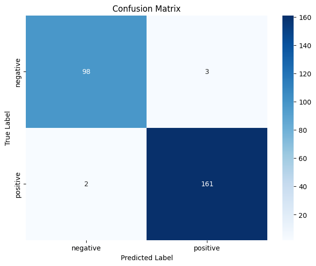

# Analisis Prediksi Serangan Jantung Menggunakan Random Forest

## Ringkasan

Proyek ini bertujuan untuk menganalisis dataset medis terkait serangan jantung dan membangun model prediksi menggunakan algoritma Random Forest. Dataset mencakup berbagai fitur medis seperti tekanan darah, gula darah, dan detak jantung. Dengan membangun model yang akurat, kita dapat membantu dalam prediksi dini serangan jantung dan mengambil tindakan pencegahan yang diperlukan.

## Permasalahan

- Bagaimana cara mengoptimalkan parameter model Random Forest untuk mendapatkan hasil prediksi terbaik?
- Bagaimana performa model dalam memprediksi serangan jantung berdasarkan fitur-fitur medis yang diberikan?

## Tujuan

Mengoptimalkan parameter model Random Forest.
Mengevaluasi kinerja model dengan metrik akurasi, presisi, recall, dan F1-score.
Memvisualisasikan hasil model untuk pemahaman yang lebih baik.

### Model

Random Forest Classifier

## Penjelasan Dataset

Deskripsi Dataset
Dataset berisi informasi medis pasien dengan kolom sebagai berikut:

    - Age: Usia pasien
    - Gender: Jenis kelamin pasien
    - Heart rate: Detak jantung pasien
    - Systolic blood pressure (ap_hi): Tekanan darah sistolik
    - Diastolic blood pressure (ap_lo): Tekanan darah diastolik
    - Blood sugar: Gula darah
    - Result: Hasil diagnosis (0: Tidak ada serangan jantung, 1: Ada serangan jantung)

## Exploratory Data Analysis (EDA)

- Distribusi Gender
  Analisis distribusi pasien berdasarkan jenis kelamin.
  

- Distribusi Fitur
  Analisis distribusi untuk fitur-fitur seperti usia, detak jantung, tekanan darah, dan gula darah menggunakan histogram.
  

- Korelasi
  EDA (Exploratory Data Analysis):
  

## Proses Features Dataset

- Penggantian nama kolom untuk keseragaman.
- Encoding variabel target menggunakan LabelEncoder.

## Proses Modeling

#### Pembagian Data

Data dibagi menjadi set pelatihan (80%) dan set pengujian (20%).

#### Hyperparameter Tuning

    param_grid = {
        'n_estimators': [50, 100, 200],
        'max_depth': [None, 10, 20, 30],
        'min_samples_split': [2, 5, 10],
        'min_samples_leaf': [1, 2, 4]
    }
    grid_search = GridSearchCV(RandomForestClassifier(random_state=42), param_grid, cv=3, n_jobs=-1, verbose=2)
    grid_search.fit(X_train, y_train)

Menggunakan GridSearchCV untuk menemukan kombinasi terbaik dari parameter seperti n_estimators, max_depth, min_samples_split, dan min_samples_leaf.

#### Pelatihan Model

Melatih model Random Forest dengan parameter terbaik yang ditemukan dari GridSearchCV.

    best_params = grid_search.best_params_
    print("Best parameters found: ", best_params)

    best_model = RandomForestClassifier(**best_params, random_state=42)
    best_model.fit(X_train, y_train)
    predictions = best_model.predict(X_test)

## Performa Model

    Accuracy: 0.9810606060606061
    Precision: 0.9817073170731707
    Recall: 0.9877300613496932
    F1 Score: 0.9847094801223242

1. Akurasi
   Mengukur seberapa sering model membuat prediksi yang benar.

2. Confusion Matrix
   Matriks yang menunjukkan jumlah prediksi benar dan salah untuk setiap kelas.

3. Presisi
   Mengukur ketepatan dari prediksi positif yang dibuat oleh model.

4. Recall
   Mengukur kemampuan model untuk menemukan semua sampel positif.

5. F1-score
   Rata-rata harmonis dari presisi dan recall.

## Diskusi Hasil dan Kesimpulan

#### Diskusi Hasil

- Akurasi: Menunjukkan tingkat keberhasilan model dalam memprediksi serangan jantung.
- Confusion Matrix: Memberikan pemahaman yang lebih dalam tentang kinerja model pada masing-masing kelas.
- Presisi, Recall, dan F1-score: Menyediakan metrik tambahan untuk mengevaluasi kinerja model, terutama pada kelas yang tidak seimbang.

#### Kesimpulan

Model Random Forest yang dioptimalkan menunjukkan kinerja yang baik dalam memprediksi serangan jantung.
Hyperparameter tuning berkontribusi signifikan dalam meningkatkan performa model.
Visualisasi hasil membantu dalam interpretasi dan pemahaman lebih mendalam tentang kekuatan dan kelemahan model.
